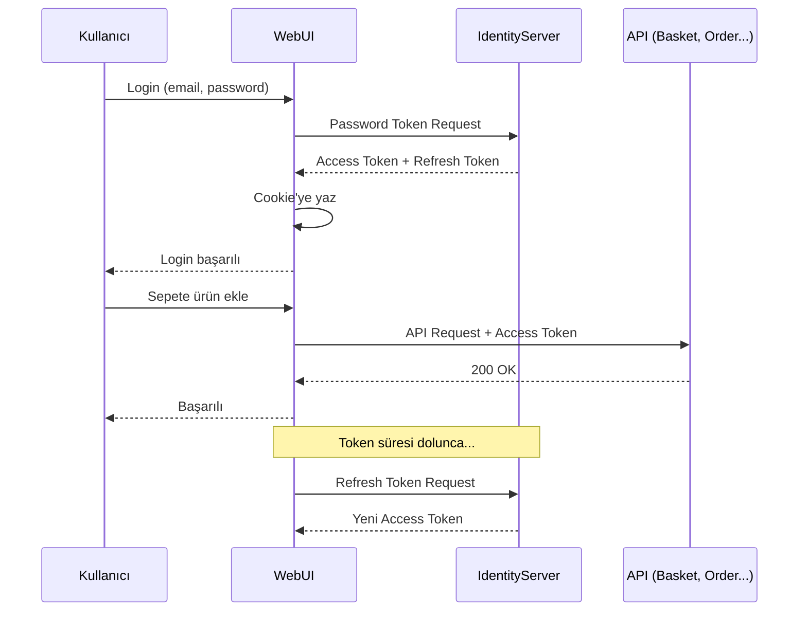

# IdentityService Sınıfı - Detaylı Açıklama

Bu doküman, `IdentityService` sınıfının nasıl çalıştığını adım adım açıklar. OAuth 2.0 ve OpenID Connect protokollerini kullanarak kimlik doğrulama işlemlerini yönetir.

---

## 📦 Bağımlılıklar ve Dependency Injection

```csharp
private readonly HttpClient _httpClient;
private readonly IHttpContextAccessor _httpContextAccessor;
private readonly ClientSettings _clientSettings;
private readonly ServiceApiSettings _serviceApiSettings;
```

| Bağımlılık | Görevi |
|------------|--------|
| `HttpClient` | IdentityServer ile HTTP iletişimi sağlar |
| `IHttpContextAccessor` | Mevcut HTTP context'e erişim (cookie okuma/yazma) |
| `ClientSettings` | OAuth client bilgileri (ClientId, ClientSecret) |
| `ServiceApiSettings` | IdentityServer URL'i gibi API ayarları |

---

## 🔑 Token Sabitleri (Magic String'lerden Kaçınma)

```csharp
private const string AccessToken = "access_token";
private const string RefreshToken = "refresh_token";
private const string ExpiresAt = "expires_at";
```

> [!TIP]
> **Neden sabit kullanıyoruz?**
> - Typo hatalarını compile-time'da yakalarız
> - Refactoring kolaylaşır
> - IDE'de autocomplete desteği alırız

---

## 🔐 SignIn Metodu - Kullanıcı Girişi

```csharp
public async Task SignIn(SigninInput signinInput)
```

### Adım 1: Discovery Document Al
```csharp
var disco = await _httpClient.GetDiscoveryDocumentAsync(new DiscoveryDocumentRequest
{
    Address = _serviceApiSettings.IdentityBaseUri,
    Policy = new DiscoveryPolicy { RequireHttps = false }
});
```

**Discovery Document nedir?**
IdentityServer'ın `.well-known/openid-configuration` endpoint'inden döner. İçinde:
- Token endpoint
- UserInfo endpoint
- Revocation endpoint
- Desteklenen scope'lar

> [!NOTE]
> `RequireHttps = false` sadece development ortamında kullanılmalı. Production'da HTTPS zorunlu!

---

### Adım 2: Password Token İste (Resource Owner Password Flow)
```csharp
var token = await _httpClient.RequestPasswordTokenAsync(new PasswordTokenRequest
{
    ClientId = _clientSettings.WebClientForUser.ClientId,
    ClientSecret = _clientSettings.WebClientForUser.ClientSecret,
    UserName = signinInput.Email,
    Password = signinInput.Password,
    Address = disco.TokenEndpoint,
    Scope = "openid profile email offline_access basket_fullpermission order_fullpermission gateway_fullpermission IdentityServerApi roles"
});
```

**Scope'ların anlamı:**

| Scope | Açıklama |
|-------|----------|
| `openid` | OpenID Connect zorunlu scope'u |
| `profile` | Kullanıcı profil bilgileri (ad, soyad) |
| `email` | Email adresi |
| `offline_access` | Refresh token almak için **zorunlu** |
| `basket_fullpermission` | Basket API'ye tam erişim |
| `order_fullpermission` | Order API'ye tam erişim |
| `gateway_fullpermission` | Gateway üzerinden erişim |
| `IdentityServerApi` | IdentityServer API'lerine erişim |
| `roles` | Kullanıcı rolleri |

---

### Adım 3: Hata Kontrolü
```csharp
if (token.IsError)
{
    var content = await token.HttpResponse.Content.ReadAsStringAsync();
    var errorDto = JsonSerializer.Deserialize<ErrorDto>(content, ...);
    throw new IdentityException(errorDto?.Errors ?? new List<string> { "Giriş başarısız" });
}
```

> [!IMPORTANT]
> Exception fırlatmak, response model döndürmekten daha temiz bir yaklaşım. Controller'da try-catch ile yakalarsın.

---

### Adım 4: UserInfo Al
```csharp
var userInfo = await _httpClient.GetUserInfoAsync(new UserInfoRequest
{
    Token = token.AccessToken,
    Address = disco.UserInfoEndpoint
});
```

Access token ile kullanıcı bilgilerini (claims) alırız:
- `sub` (Subject - UserId)
- `name`
- `email`
- Custom claim'ler

---

### Adım 5: ClaimsPrincipal Oluştur ve Cookie'ye Yaz
```csharp
var claimsIdentity = new ClaimsIdentity(userInfo.Claims, 
    CookieAuthenticationDefaults.AuthenticationScheme, "name", "role");
var claimsPrincipal = new ClaimsPrincipal(claimsIdentity);

var authProps = new AuthenticationProperties { IsPersistent = signinInput.IsRemember };
authProps.StoreTokens(new List<AuthenticationToken>
{
    new() { Name = AccessToken, Value = token.AccessToken! },
    new() { Name = RefreshToken, Value = token.RefreshToken! },
    new() { Name = ExpiresAt, Value = DateTime.Now.AddSeconds(token.ExpiresIn).ToString("o", ...) }
});

await _httpContextAccessor.HttpContext!.SignInAsync(
    CookieAuthenticationDefaults.AuthenticationScheme, 
    claimsPrincipal, 
    authProps);
```

**Ne oluyor?**
1. Claim'lerden bir identity oluşturuyoruz
2. Token'ları cookie'ye gömüyoruz
3. `IsPersistent` = "Beni Hatırla" kutucuğu

```
┌─────────────────────────────────────┐
│           Browser Cookie            │
├─────────────────────────────────────┤
│  .AspNetCore.Cookies                │
│  ├── Claims (sub, name, email...)   │
│  ├── access_token                   │
│  ├── refresh_token                  │
│  └── expires_at                     │
└─────────────────────────────────────┘
```

---

## 🔄 GetAccessTokenByRefreshToken - Token Yenileme

```csharp
public async Task<TokenResponse> GetAccessTokenByRefreshToken()
```

Access token süresi dolduğunda, refresh token ile yeni bir access token alırız.

```
Kullanıcı                      WebUI                     IdentityServer
    │                            │                              │
    │── İstek (401 Unauthorized)─▶│                              │
    │                            │── Refresh Token Request ────▶│
    │                            │◀── Yeni Access Token ────────│
    │                            │── Cookie Güncelle            │
    │◀── Cevap (200 OK) ─────────│                              │
```

> [!TIP]
> Bu metod genellikle `DelegatingHandler` içinde otomatik çağrılır. Kullanıcı hiçbir şey hissetmez.

---

## 🚫 RevokeRefreshToken - Logout İşlemi

```csharp
public async Task RevokeRefreshToken()
```

Kullanıcı çıkış yaptığında:
1. Refresh token'ı IdentityServer'da geçersiz kılarız
2. Böylece eski token ile yeni access token alınamaz

> [!CAUTION]
> Sadece cookie silmek yetmez! Token revoke edilmezse, hala geçerli kalır.

---

## 📝 SignUp - Kullanıcı Kayıt

```csharp
public async Task SignUp(SignUpInput signUpInput)
```

IdentityServer'daki `/api/Users/SignUp` endpoint'ine POST isteği atar.

---

## 🎯 Özet: OAuth 2.0 Akışı



---

## 📚 Öğrenilecek Kavramlar

1. **Discovery Document**: IdentityServer meta verileri
2. **Resource Owner Password Grant**: Kullanıcı adı/şifre ile token alma
3. **Refresh Token**: Access token yenilemek için kullanılır
4. **Claims**: Kullanıcı hakkında bilgi taşıyan veri parçaları
5. **Cookie Authentication**: Token'ları browser'da saklamak
